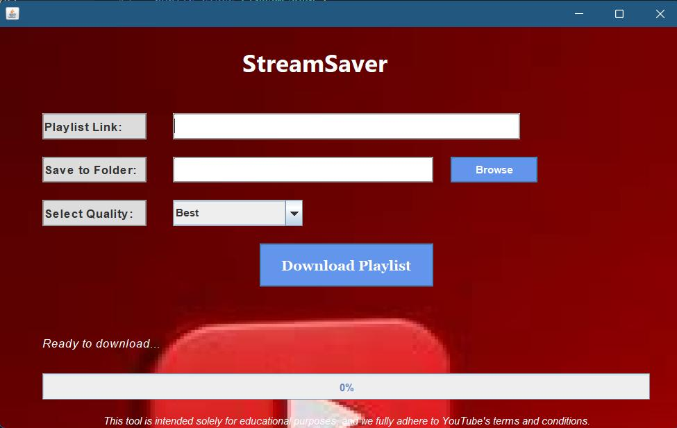
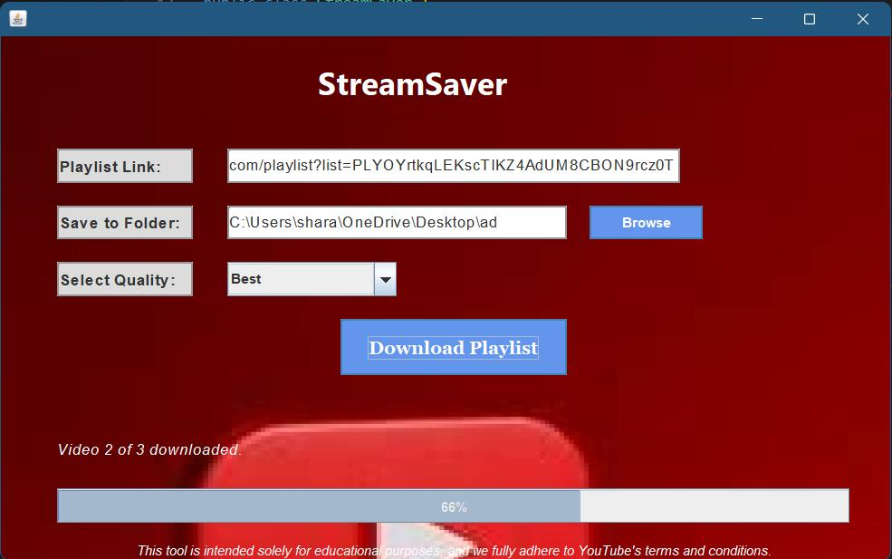

# StreamSaver

StreamSaver is a Java-based desktop application that allows users to download YouTube playlists seamlessly. With an intuitive graphical user interface (GUI) and support for customizable video quality, StreamSaver simplifies the process of downloading entire playlists to your local storage.

---

## **Features**
- 📺 **Download YouTube Playlists**: Fetch and download all videos from a YouTube playlist by simply providing the playlist URL.
- 🎥 **Customizable Quality**: Choose between options like Best, 720p, 480p, or 360p for video downloads.
- 🛠️ **Concurrent Downloads**: Download multiple videos simultaneously with optimized performance using multi-threading.
- 🔄 **Real-Time Progress Tracking**: Monitor download progress with a progress bar and real-time notifications.
- 🖼️ **Modern UI**: An easy-to-use graphical interface with a sleek, styled design.
- 💾 **Custom Save Location**: Select the folder where your videos will be saved.

---

## **Requirements**
1. Java Development Kit (JDK) 8 or higher.
2. [yt-dlp](https://github.com/yt-dlp/yt-dlp) executable file.
3. A stable internet connection.
4. Supported operating systems: Windows, Linux, and macOS.

---

## **Installation**
### Step 1: Clone the Repository
```bash
git clone https://github.com/your-username/StreamSaver.git
cd StreamSaver
```

### Step 2: Download yt-dlp
- Download the `yt-dlp` executable for your operating system from [yt-dlp Releases](https://github.com/yt-dlp/yt-dlp/releases).
- Place the `yt-dlp` executable in the project directory or a location of your choice.

### Step 3: Set Up the Project
- Open the project in your preferred IDE (e.g., IntelliJ IDEA, Eclipse, or NetBeans).
- Ensure the required JDK is set up.

### Step 4: Update the yt-dlp Path
Edit the `StreamSaver` source code to specify the correct path for `yt-dlp`:
```java
String ytDlpPath = "C:\\path\\to\\yt-dlp.exe"; // Update this to the path where yt-dlp is located
```

### Step 5: Run the Application
Compile and run the `StreamSaver` class.

---

## **Usage**
### Step 1: Launch the Application
Run the program to open the graphical interface.

### Step 2: Input Details
- Enter the playlist link in the "Playlist Link" field.
- Select a folder where the videos will be saved.
- Choose the desired quality from the dropdown menu.

### Step 3: Start the Download
- Click on the "Download Playlist" button to start downloading.
- Monitor progress through the progress bar and notifications.

### Step 4: Access Your Videos
Upon completion, find your downloaded videos in the selected folder.

---
## **Screenshots**

### Main Interface
```plaintext
[Main Interface Screenshot Placeholder]

```

### Progress Updates
```plaintext
[Progress Updates Screenshot Placeholder]

```
---

## **Project Structure**
```plaintext
StreamSaver/
│
├── src/
│   ├── StreamSaver.java          # Main application file
│
├── yt-dlp.exe                    # Place your yt-dlp executable here
├── README.md                     # Project documentation
└── LICENSE                       # License information
```

---

## **Limitations**
- This application is intended only for educational purposes.
- Ensure compliance with YouTube's Terms of Service.

---

## **Common Errors**
### 1. yt-dlp Not Found
**Cause**: The yt-dlp path is incorrect or the executable is missing.  
**Solution**: Update the `ytDlpPath` variable in the source code with the correct path to yt-dlp.

### 2. Download Fails for Specific Videos
**Cause**: Some videos may have download restrictions or unsupported formats.  
**Solution**: Check the yt-dlp logs for error details.

### 3. Java Version Issues
**Cause**: Using an incompatible Java version.  
**Solution**: Ensure JDK 8 or higher is installed.

---

## **License**
This project is licensed under the MIT License. See the LICENSE file for more details.

---

## **Acknowledgments**
- Built with Java Swing.
- Powered by yt-dlp.
- Inspired by the need for simple playlist management and educational purposes.

---

## **Contributing**
Contributions are welcome! Feel free to fork this repository and submit a pull request for any improvements.

### How to Contribute
1. Fork the project.
2. Create your feature branch:
   ```bash
   git checkout -b feature/AmazingFeature
   ```
3. Commit your changes:
   ```bash
   git commit -m "Add some AmazingFeature"
   ```
4. Push to the branch:
   ```bash
   git push origin feature/AmazingFeature
   ```
5. Open a pull request.


    


 
